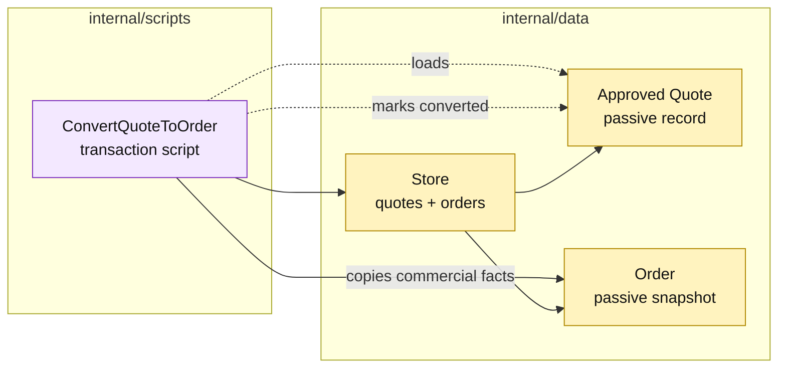

# Lesson 007: Convert An Approved Quote Into An Order

## Objective

Add a transaction script that converts an approved quote into a separate order record by copying the committed commercial snapshot.

## Theory

Quote and order represent different business moments. A quote is editable and negotiable; an order is a committed transaction. Conversion therefore needs a clear boundary:

1. load the quote;
2. require `Approved`;
3. copy customer, product, quantity, and price facts into order lines;
4. create and save a new order;
5. mark the quote as converted.

The order does not keep a pointer to the quote's line slice. It receives a passive snapshot so later quote changes cannot alter committed order data.

## Why This Matters Here

This is the first cross-record transaction in the track. Transaction Script keeps the orchestration in one procedure, which makes the sequence direct and easy to follow. The cost is that the procedure knows both record shapes and must coordinate their consistency explicitly.

Inventory reservation is intentionally not included yet. Keeping that side effect for the next lesson makes the conversion boundary visible before it grows.

## Diagram

Legend:

- purple: procedural workflow;
- yellow: passive records and storage;
- solid arrow: snapshot creation or persistence;
- dashed arrow: record lookup or mutation.

## Implementation Focus

Implement only:

- passive `Order` and `OrderLine` records;
- order storage and sequential IDs;
- `Converted` quote state and source-order metadata;
- the `ConvertQuoteToOrder` script;
- tests for approved conversion, snapshots, and rejected source states;
- a CLI conversion of the standard quote.

Leave inventory reservation, payment, and shipment for later lessons.

## What To Verify

- `go test ./...` passes from `transaction-script-architecture/`;
- only an approved quote converts;
- the order receives independent line snapshots;
- the quote records its converted order;
- conversion does not reserve stock yet.
