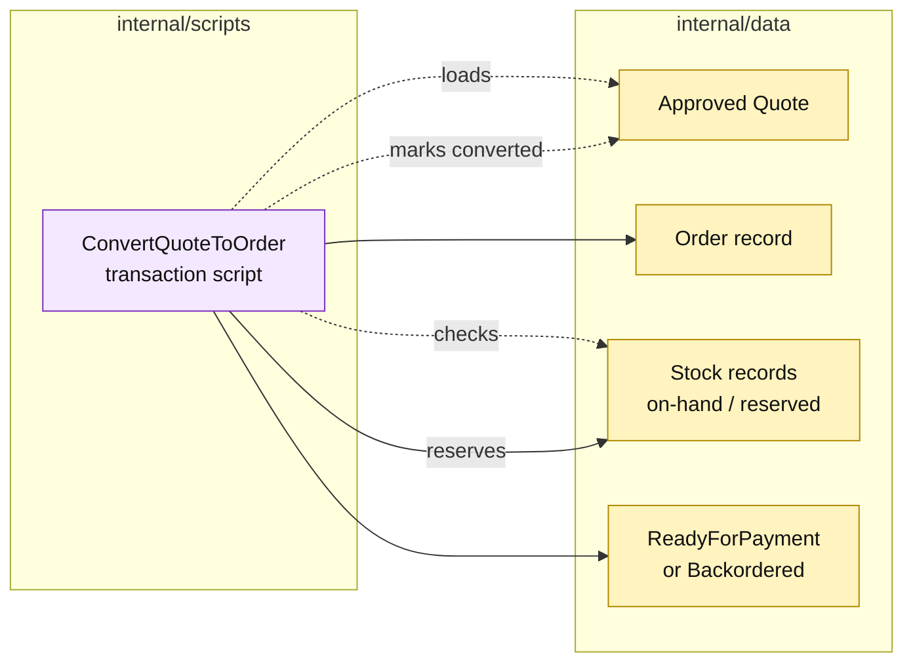

# Lesson 008: Convert The Order And Reserve Stock

## Objective

Extend quote conversion so the transaction script reserves inventory and records whether the new order is ready for payment or backordered.

## Theory

The previous lesson created an order snapshot but stopped before claiming stock. Real conversion must coordinate two passive record sets:

1. inspect the approved quote;
2. build the order snapshot;
3. check available stock for every line;
4. reserve stock where possible;
5. reject the whole conversion for a hard shortage, or mark the order `Backordered` when the product allows it;
6. save the order and mark the quote converted.

The script performs a preflight before mutating either quote or stock. That keeps a failed conversion from leaving a half-created order or a partial reservation.

## Why This Matters Here

This is the first multi-record consistency problem in the Transaction Script track. The direct procedure makes the sequence and the tradeoff obvious:

- there is little abstraction between the script and storage;
- the script can keep a small in-memory transaction coherent;
- the same coordination becomes harder to maintain as more side effects join the workflow.

No inventory gateway or aggregate is introduced. The stock record remains data and the script owns reservation arithmetic.

## Diagram

Legend:

- purple: procedural business behavior;
- yellow: passive records and resulting state;
- dashed arrows: reads or record mutation;
- solid arrows: coordinated writes or decisions.

## Implementation Focus

Implement only:

- passive `StockRecord` data and shortage-policy fields;
- stock storage in `Store`;
- reservation arithmetic inside `ConvertQuoteToOrder`;
- hard-shortage rejection and allow-backorder behavior;
- tests for complete reservation, insufficient stock, and backorder;
- demo stock sufficient for the standard order.

Leave payment capture and shipment creation for later lessons.

## What To Verify

- `go test ./...` passes from `transaction-script-architecture/`;
- successful conversion increments reserved stock;
- a hard shortage creates no order and changes no quote;
- an allowed shortage creates a `Backordered` order;
- a fully reserved order becomes `ReadyForPayment`.
