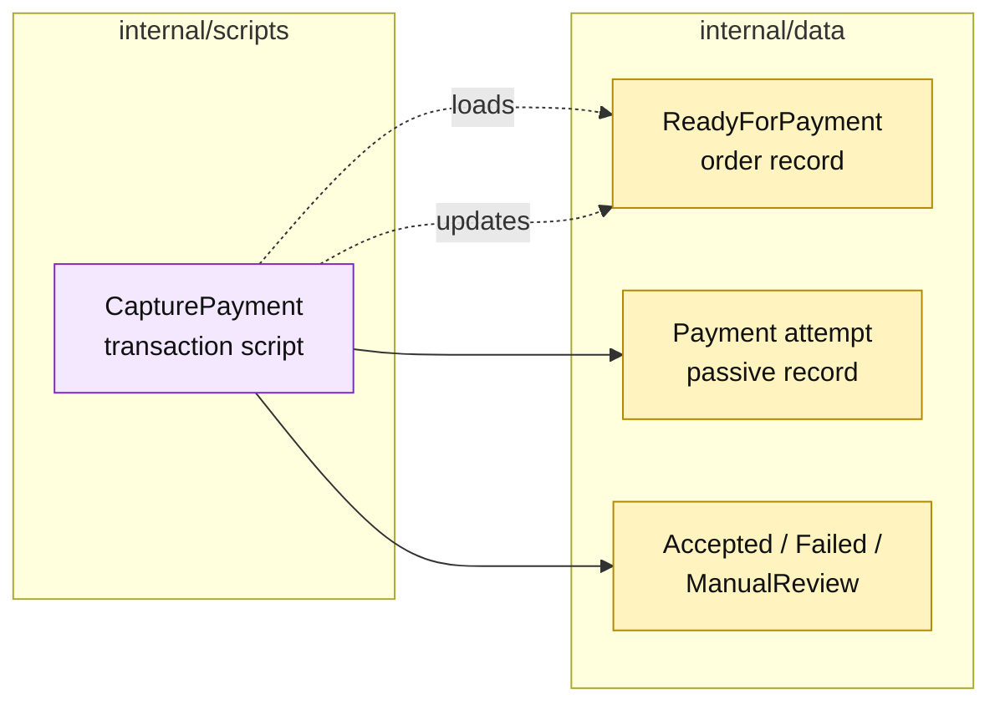

# Lesson 009: Capture Payment For A Reserved Order

## Objective

Add a payment-capture transaction script that records the payment outcome and moves an order into fulfillment, retry, or review state.

## Theory

Once stock is reserved, the order is ready for payment. `CapturePayment` coordinates:

1. load the order;
2. require `ReadyForPayment`;
3. create a payment attempt for the order total;
4. apply the simulated outcome;
5. persist both payment and order records.

The outcome is intentionally represented as input to a small transaction-script example: `accept`, `fail`, or `review`. An accepted payment moves the order to `ReadyForFulfillment`; a review moves it to `PaymentReview`; a failure leaves it retryable.

## Why This Matters Here

Payment introduces a different side effect from inventory. Reservation is quantity arithmetic; payment is an external business outcome. Transaction Script keeps both visible in one procedure, which is direct for a small application but couples the procedure to the payment record and order lifecycle fields.

## Diagram

Legend:

- purple: procedural workflow;
- yellow: passive payment/order data and state;
- dashed arrows: record reads or updates;
- solid arrows: payment creation and outcome choice.

## Implementation Focus

Implement only:

- payment status values and a passive `Payment` record;
- payment storage and sequential payment IDs;
- the `CapturePayment` script;
- accepted, failed, manual-review, and invalid-state tests;
- a CLI capture of the reserved standard order.

Leave payment-review approval and shipment creation for later lessons.

## What To Verify

- `go test ./...` passes from `transaction-script-architecture/`;
- accepted payment creates a payment and makes the order ready for fulfillment;
- failed payment remains retryable;
- review outcome moves the order to `PaymentReview`;
- orders that are not ready for payment cannot be captured.
