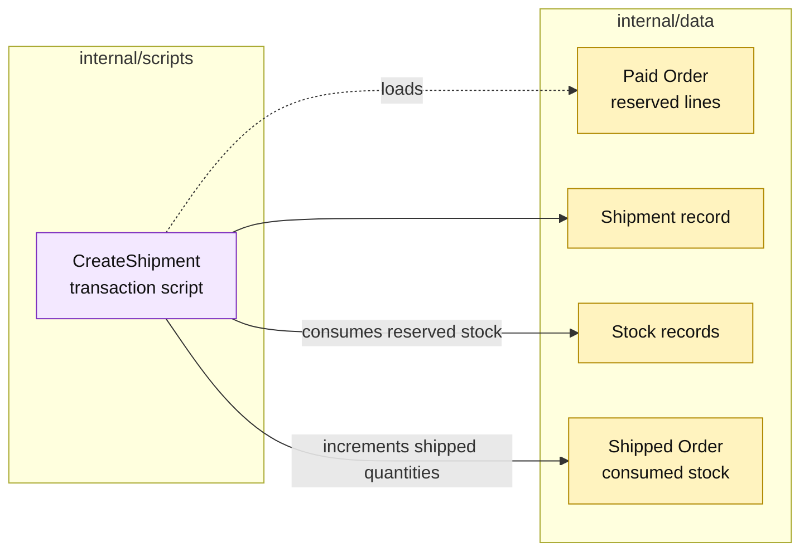

# Lesson 010: Create A Shipment After Payment

## Objective

Add a shipment transaction script that ships a paid order and consumes the stock reserved during conversion.

## Theory

Shipment is a separate business record, but it must stay consistent with the order and inventory records. The script will:

1. load the order;
2. require `ReadyForFulfillment`;
3. derive the remaining reserved quantities;
4. create a shipment record;
5. increment the order's shipped quantities and set `Shipped`;
6. consume the corresponding on-hand and reserved stock;
7. save the shipment and order.

The operation remains procedural. There is no shipment aggregate method or inventory adapter hiding the sequence.

## Why This Matters Here

This lesson completes the first end-to-end sales chain:

`Quote -> Order -> Reservation -> Payment -> Shipment`

The direct script makes the consistency responsibilities easy to see. It also shows the pressure that will matter later: more fulfillment modes will make a single full-shipment procedure more complex.

## Diagram

Legend:

- purple: procedural coordination;
- yellow: passive order, shipment, and inventory records;
- dashed arrow: record lookup;
- solid arrows: coordinated writes.

## Implementation Focus

Implement only:

- passive `Shipment` and `ShipmentLine` records;
- shipment storage and IDs;
- a full-order `CreateShipment` transaction script;
- payment-gate and missing-reservation validation;
- tests proving shipment persistence and stock consumption;
- the CLI happy path through shipment.

Leave cancellation, partial shipment, and shipment queries for later lessons.

## What To Verify

- `go test ./...` passes from `transaction-script-architecture/`;
- only a paid/fulfillable order can ship;
- a shipment is persisted with all remaining lines;
- order status becomes `Shipped`;
- on-hand and reserved quantities are consumed exactly once.
