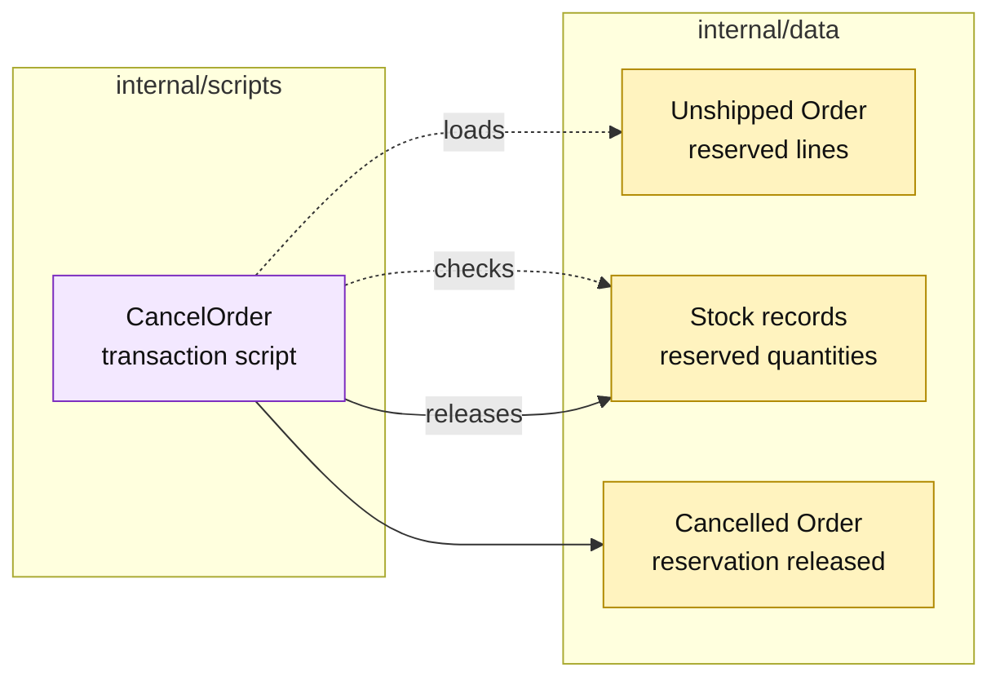

# Lesson 011: Cancel An Order And Release Reserved Stock

## Objective

Add a cancellation transaction script that stops an unshipped order and releases its reserved inventory.

## Theory

Cancellation is a reverse path, not just another status update. The script must:

1. load the order;
2. reject cancellation after shipment or after a previous cancellation;
3. validate the cancelling actor and reason;
4. release every outstanding reservation;
5. set cancellation metadata and status;
6. save the order and stock records.

The script performs a preflight before changing either record set. It keeps the order and inventory state aligned inside the in-memory store.

## Why This Matters Here

The happy path showed how direct orchestration is easy to follow. Cancellation exposes the cost of that simplicity: the script now needs to understand both the order lifecycle and reservation arithmetic. As more reverse flows arrive, repeated coordination becomes a pressure point for this architecture.

## Diagram

Legend:

- purple: procedural coordination;
- yellow: passive order, stock, and resulting state;
- dashed arrows: reads and preflight checks;
- solid arrows: released reservation and cancellation write.

## Implementation Focus

Implement only:

- cancellation metadata on `Order`;
- a `CancelOrder` transaction script;
- reservation-release arithmetic;
- actor, reason, shipped-order, and already-cancelled validation;
- tests for successful release and refused cancellation.

Leave returns and refund processing for later lessons.

## What To Verify

- `go test ./...` passes from `transaction-script-architecture/`;
- an unshipped order becomes `Cancelled`;
- reserved stock is released exactly once;
- a shipped order cannot be cancelled;
- invalid cancellation input leaves the order and stock unchanged.
