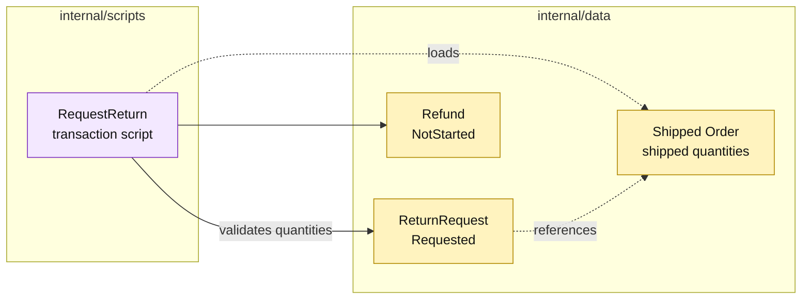

# Lesson 012: Request A Return And Record Refund State

## Objective

Introduce return requests and refund records, then add a transaction script that validates a return against shipped order quantities.

## Theory

Returns are different from cancellation because the order has already shipped. `RequestReturn` will:

1. load a shipped or partially shipped order;
2. select explicit return lines, or derive all currently returnable shipped lines;
3. ensure quantities do not exceed shipped minus already returned quantities;
4. create a `Requested` return record with a calculated refund amount;
5. leave the refund in `NotStarted` state for a later decision.

The refund record is introduced as data, not as a payment interface. Transaction Script keeps the request workflow and its quantity checks in one procedure.

## Why This Matters Here

The forward flow now has a corresponding post-shipment request path. The direct script makes the important distinction between:

- a request to reverse shipped goods;
- the later financial and inventory side effects.

Keeping those steps separate prevents a request from silently restocking or refunding before the business has reviewed it.

## Diagram

Legend:

- purple: procedural workflow;
- yellow: passive order, return, and refund records;
- dashed arrows: reads or references;
- solid arrows: record creation and validation.

## Implementation Focus

Implement only:

- return and refund status values;
- passive `ReturnRequest`, `ReturnLine`, and `Refund` records;
- storage and sequential IDs;
- the `RequestReturn` transaction script;
- shipped-state, quantity, and default-line tests.

Leave refund completion, inventory restocking, review decisions, and eligibility policy for later lessons.

## What To Verify

- `go test ./...` passes from `transaction-script-architecture/`;
- only shipped or partially shipped orders can create returns;
- requested quantities cannot exceed remaining returnable quantities;
- a request starts in `Requested` state;
- refund state starts as `NotStarted` and no stock changes yet.
