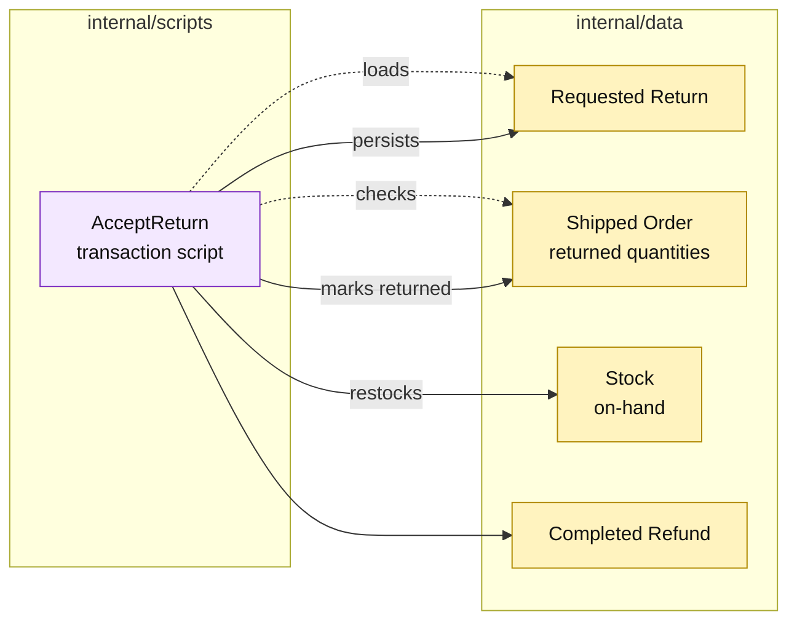

# Lesson 013: Accept A Return, Refund, And Restock

## Objective

Extend the return workflow so an accepted request updates returned quantities, completes a refund, and puts the goods back into stock.

## Theory

The return request from the previous lesson is only a record of intent. `AcceptReturn` now coordinates the reverse side effects:

1. load the return and its shipped order;
2. confirm the requested quantities are still returnable;
3. confirm stock records can be updated;
4. mark the order lines returned;
5. increase on-hand inventory;
6. create a completed refund record;
7. persist the completed return.

This lesson deliberately keeps the workflow compressed. A later lesson will insert an explicit review decision so acceptance and financial processing are no longer one step.

## Why This Matters Here

The forward path consumed inventory; returns must reverse that consumption without touching reservations. The script makes the distinction concrete:

- cancellation releases reserved stock before shipment;
- an accepted return restocks shipped goods after shipment.

The tradeoff is more cross-record knowledge inside one procedure, including refund arithmetic and order-line mutation.

## Diagram

Legend:

- purple: procedural coordination;
- yellow: passive records and side effects;
- dashed arrows: reads and validation;
- solid arrows: writes and reverse effects.

## Implementation Focus

Implement only:

- an `AcceptReturn` transaction script;
- return-line and stock preflight validation;
- returned-quantity updates and restocking;
- completed refund creation;
- tests covering refund, restock, and invalid return state.

Leave explicit rejection and a separate review state for the next lesson.

## What To Verify

- `go test ./...` passes from `transaction-script-architecture/`;
- accepting a requested return completes a refund;
- shipped quantities become returned quantities;
- on-hand inventory increases by the returned quantity;
- invalid or repeated acceptance performs no second side effect.
