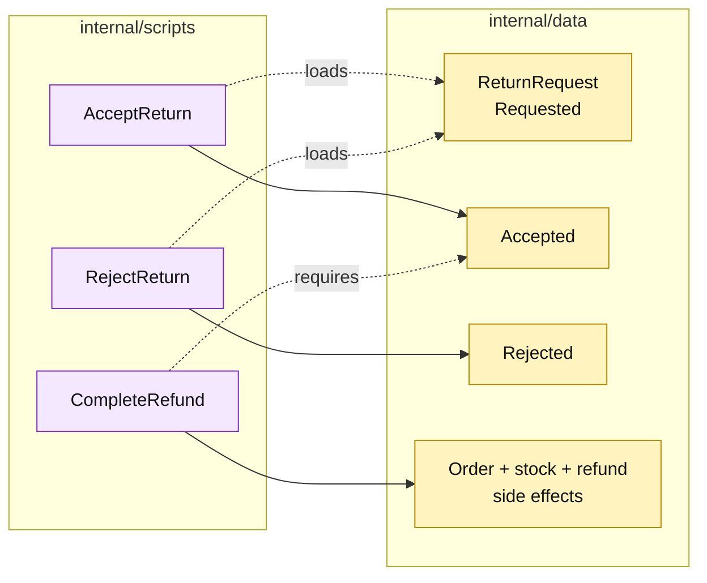

# Lesson 014: Separate Return Review From Refund Processing

## Objective

Split the return workflow into request, review, and financial/inventory processing so rejected returns never trigger side effects.

## Theory

The previous lesson compressed these steps:

`Requested -> refund + restock -> Refunded`

That is too optimistic for a real return workflow. This lesson introduces three procedural commands:

- `AcceptReturn`: move a requested return to `Accepted`;
- `RejectReturn`: move a requested return to `Rejected`;
- `CompleteRefund`: for an accepted return, update the order, restock inventory, and complete the refund.

The return record remains passive. The scripts own the legal status checks and the ordering of side effects.

## Why This Matters Here

Transaction Script does not require every workflow to be one giant procedure. It can represent a multi-step process as several focused procedures over shared records. The benefit is a visible review boundary; the cost is that each script must understand the same return lifecycle and coordinate the hand-off correctly.

## Diagram

Legend:

- purple: transaction scripts;
- yellow: passive workflow state and side effects;
- dashed arrows: state lookup or precondition;
- solid arrows: state transition or coordinated write.

## Implementation Focus

Implement only:

- explicit `AcceptReturn` and `RejectReturn` review scripts;
- `CompleteRefund` for accepted returns;
- the `Requested -> Accepted/Rejected -> Refunded` lifecycle;
- tests proving rejection blocks refund/restock and acceptance requires a separate completion step.

Leave reviewer metadata, return policy, and idempotency for later lessons.

## What To Verify

- `go test ./...` passes from `transaction-script-architecture/`;
- requested returns can be accepted or rejected;
- rejected returns cannot be refunded or restocked;
- accepted returns do not change inventory until `CompleteRefund` runs;
- only accepted returns can complete a refund.
