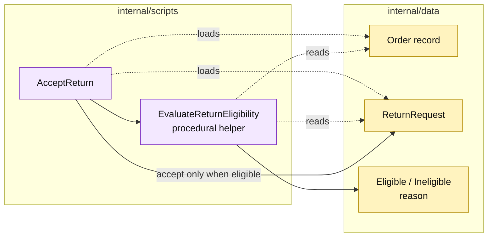

# Lesson 015: Add A Procedural Return Eligibility Check

## Objective

Introduce a reusable return-eligibility procedure and apply it before a return can be accepted.

## Theory

A return request can be structurally valid and still fail a product policy. The first canonical rule is that clearance products are not returnable.

`EvaluateReturnEligibility` answers that policy question without changing records. `AcceptReturn` remains responsible for the review transaction, but it now calls the helper before moving the request to `Accepted`.

This is the Transaction Script equivalent of a policy boundary: a named function returning a decision, not an interface, injected service, or method on `Product`.

## Why This Matters Here

The repository now has two extracted procedural decisions:

- quote approval requirements;
- return eligibility.

That keeps local workflows readable and enables reuse, but the helpers still depend on passive record fields and shared conventions such as the `Clearance` category. The accumulating rule knowledge is the architectural pressure this track is meant to expose.

## Diagram

Legend:

- purple: procedural behavior;
- yellow: passive records and decision value;
- dashed arrows: record reads;
- solid arrows: procedural call and lifecycle write.

## Implementation Focus

Implement only:

- an eligibility decision value and reason code;
- `EvaluateReturnEligibility` for clearance and normal products;
- `AcceptReturn` using the helper;
- tests proving ineligible returns remain requested and cause no side effects.

Leave date windows and clock handling for the next lesson.

## What To Verify

- `go test ./...` passes from `transaction-script-architecture/`;
- clearance returns are rejected before acceptance;
- normal returns remain eligible;
- evaluating eligibility does not mutate the order or request;
- accepted returns still require the existing refund completion step.
