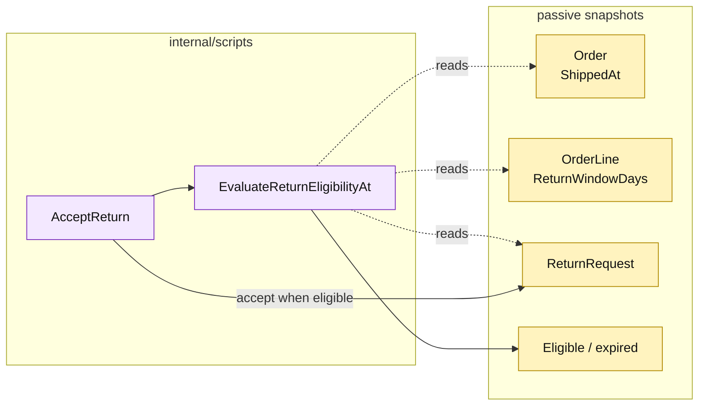

# Lesson 016: Enforce A Real Return Window

## Objective

Add shipment timestamps and product return-window snapshots, then reject returns requested after the allowed date window.

## Theory

The clearance rule is not enough for return eligibility. A return may also be ineligible because too much time has passed since shipment.

This lesson adds:

- `ShippedAt` on the order;
- `ReturnWindowDays` on product, quote-line, and order-line snapshots;
- a date comparison in `EvaluateReturnEligibilityAt`.

The transaction scripts still use direct data and `time.Now()`. A time-parameterized form is exposed for tests and deterministic demonstrations, but no clock port is introduced.

## Why This Matters Here

The rule is now more realistic and more coupled to data history. Transaction Script makes that coupling visible: the acceptance procedure must know where shipment time and the product's window live, and it must decide what to do when old records lack the new snapshot.

The implementation uses a 30-day default when a legacy line has no explicit window.

## Diagram

Legend:

- purple: procedural rule and workflow;
- yellow: passive historical data and decision;
- dashed arrows: data reads;
- solid arrows: procedural call and state write.

## Implementation Focus

Implement only:

- return-window fields and shipment timestamps;
- snapshot propagation from product to quote line to order line;
- date-aware eligibility evaluation;
- deterministic `RequestReturnAt` and `AcceptReturnAt` test seams;
- tests for inside and outside windows.

Leave reviewer/processor actors for the next lesson.

## What To Verify

- `go test ./...` passes from `transaction-script-architecture/`;
- a return inside its window remains eligible;
- a return after its window is rejected;
- shipment time and window values are carried by passive snapshots;
- no clock interface or domain method is introduced.
