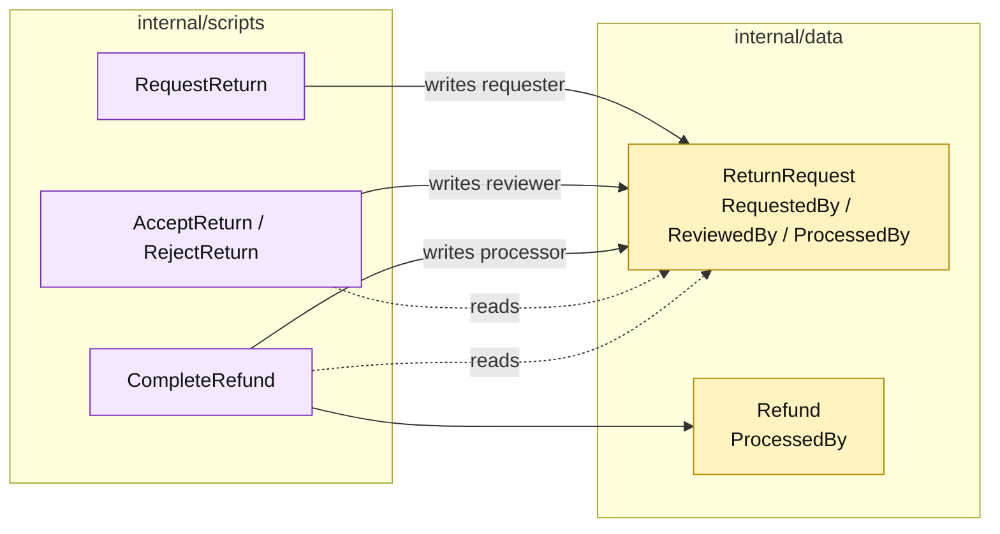

# Lesson 017: Record Return Actors

## Objective

Carry requester, reviewer, and refund-processor identities through the return workflow and require them at the transaction that needs each actor.

## Theory

The return lifecycle now has three operational moments:

- request the return;
- review and accept or reject it;
- complete the refund and restock.

Each moment needs accountability. The scripts will require and persist:

- `RequestedBy` on `RequestReturn`;
- `ReviewedBy` on `AcceptReturn` and `RejectReturn`;
- `ProcessedBy` on `CompleteRefund` and its refund record.

These are still plain fields on a passive record. The procedures validate that the relevant actor exists before mutating state.

## Why This Matters Here

Transaction Script is not limited to state and arithmetic. It can preserve operational business facts directly in records. The tradeoff is wider command signatures and more validation repeated across related procedures.

## Diagram

Legend:

- purple: transaction scripts;
- yellow: passive audit metadata;
- dashed arrows: reads and preconditions;
- solid arrows: metadata persistence.

## Implementation Focus

Implement only:

- actor-required validation;
- actor parameters on request, review, and refund scripts;
- persistence of all actor fields;
- refund processor metadata;
- tests for valid metadata and missing actors.

Leave idempotency for the next lesson.

## What To Verify

- `go test ./...` passes from `transaction-script-architecture/`;
- request, review, and refund actors are stored;
- missing actors are rejected before state or side effects change;
- rejected returns store reviewer metadata without creating refunds.
