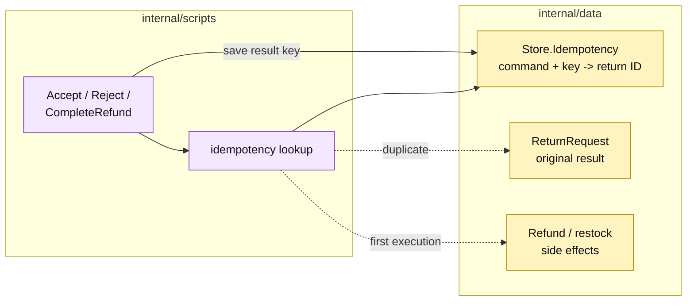

# Lesson 018: Make Return Commands Idempotent

## Objective

Make return review and refund commands safe to retry by storing a command key and returning the original result on duplicates.

## Theory

The return workflow now performs meaningful side effects. A timeout or double submission could otherwise:

- accept or reject the same request twice;
- create a second refund;
- restock the same goods twice.

The scripts will require an idempotency key for `AcceptReturn`, `RejectReturn`, and `CompleteRefund`. The shared `Store` keeps a simple command-to-return mapping. On a duplicate key, the script loads and returns the original request without executing the workflow again.

## Why This Matters Here

Transaction Script can handle retry safety, but the application-level convention is explicit in every affected procedure. That is easy to understand locally and easy to forget when a new command is added—the characteristic tradeoff remains visible.

## Diagram

Legend:

- purple: procedural retry handling;
- yellow: passive idempotency and business records;
- dashed arrows: duplicate short-circuit or first-execution branch;
- solid arrows: lookup and persistence.

## Implementation Focus

Implement only:

- an idempotency map in `Store`;
- required command keys;
- duplicate short-circuit behavior for return review and refund scripts;
- tests proving refund/restock happen once and rejection retries do not rewrite state.

Leave query surfaces for later lessons.

## What To Verify

- `go test ./...` passes from `transaction-script-architecture/`;
- missing keys are rejected;
- repeating a successful accept returns the original request;
- repeating refund completion does not create a second refund or restock twice;
- repeating rejection returns the original rejected request.
