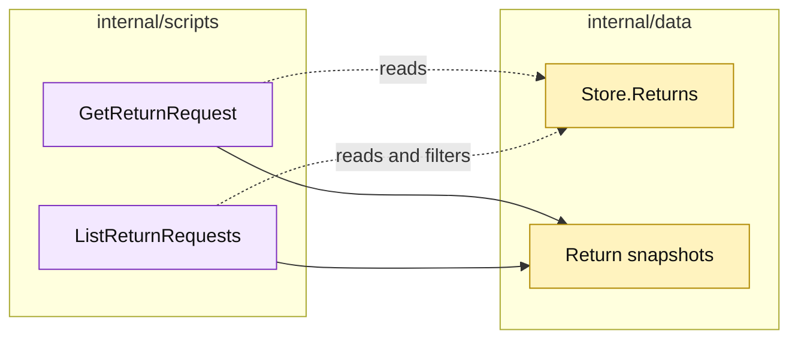

# Lesson 019: Add Return Query Scripts

## Objective

Expose return reads through `GetReturnRequest` and `ListReturnRequests` procedures instead of leaking the store maps to callers.

## Theory

The return workflow now has several states, actors, refund metadata, and retry keys. A caller should not need to know how those records are stored to read them.

The query scripts will:

- load one return request by ID;
- list requests with an optional status filter;
- sort results deterministically;
- return copies of passive records so a caller cannot mutate the store accidentally.

They do not perform workflow decisions or writes.

## Why This Matters Here

Transaction Script often emphasizes commands, but read procedures are useful when record shape becomes non-trivial. The tradeoff is small and explicit query code; the benefit is a named read surface that can evolve independently from storage details.

## Diagram

Legend:

- purple: read procedures;
- yellow: passive storage and returned snapshots;
- dashed arrows: non-mutating reads;
- solid arrows: result shaping.

## Implementation Focus

Implement only:

- `GetReturnRequest`;
- `ListReturnRequests` with optional status filtering;
- deterministic ID ordering and defensive line-slice copies;
- query tests for found, missing, filtered, and unfiltered cases.

Leave order, shipment, and quote query surfaces for later lessons.

## What To Verify

- `go test ./...` passes from `transaction-script-architecture/`;
- one return can be read by ID;
- missing IDs return the existing business error;
- status filtering works;
- returned slices are independent snapshots.
