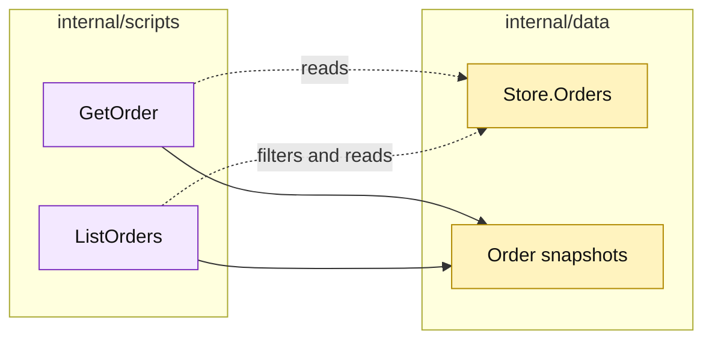

# Lesson 020: Add Order Query Scripts

## Objective

Expose order reads through `GetOrder` and `ListOrders` procedures rather than direct map access.

## Theory

Orders now carry quote snapshots, reservation state, payment state, fulfillment state, and cancellation metadata. Query procedures provide a stable read surface for that growing record.

The scripts will:

- load one order by ID;
- list orders with an optional status filter;
- sort by order ID;
- copy line slices before returning results.

They remain read-only and do not reuse command procedures for convenience.

## Why This Matters Here

The Transaction Script shape works for queries as well as commands, but the distinction is worth naming. Keeping reads separate prevents a caller from accidentally invoking a state-changing workflow just to inspect an order.

## Diagram

Legend:

- purple: query procedures;
- yellow: passive storage and snapshots;
- dashed arrows: non-mutating reads;
- solid arrows: result shaping.

## Implementation Focus

Implement only:

- `GetOrder`;
- `ListOrders` with optional status filtering;
- deterministic order-ID sorting and defensive line copies;
- query tests for found, missing, filtered, and unfiltered results.

Leave shipment and quote query surfaces for later lessons.

## What To Verify

- `go test ./...` passes from `transaction-script-architecture/`;
- one order can be read by ID;
- missing orders return a business error;
- status filtering and sorting work;
- modifying a returned line slice does not mutate the store.
