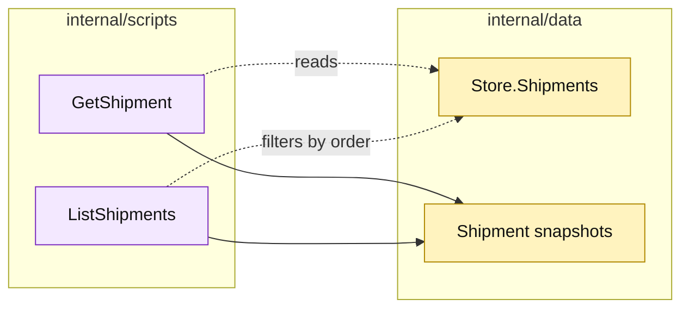

# Lesson 021: Add Shipment Query Scripts

## Objective

Expose shipment reads through `GetShipment` and `ListShipments` procedures.

## Theory

Shipment records are now part of the fulfillment history. Query callers need a named way to inspect one shipment or all shipments for an order without depending on the store's map layout.

The query scripts read only, filter by order when requested, sort by shipment ID, and copy line slices before returning.

## Why This Matters Here

The order query surface shows current order state; shipment queries show fulfillment history. Keeping them as separate scripts makes that distinction explicit while preserving the low-ceremony Transaction Script style.

## Diagram

Legend:

- purple: query procedures;
- yellow: passive storage and snapshots;
- dashed arrows: reads and filters;
- solid arrows: result shaping.

## Implementation Focus

Implement only:

- `GetShipment`;
- `ListShipments` filtered by optional order ID;
- deterministic sorting and defensive line copies;
- query tests for found, missing, filtered, and unfiltered results.

Leave quote and catalog query surfaces for later lessons.

## What To Verify

- `go test ./...` passes from `transaction-script-architecture/`;
- a shipment can be read by ID;
- shipments can be listed by order;
- missing shipments return a business error;
- query snapshots cannot mutate stored lines.
