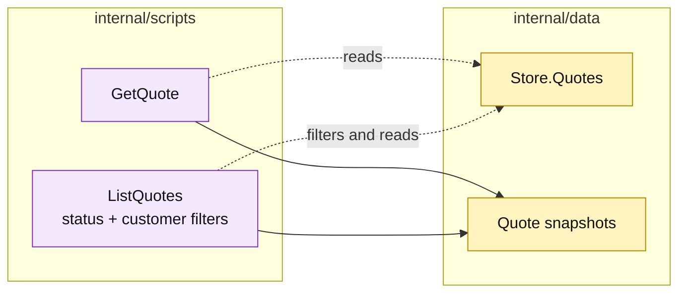

# Lesson 022: Add Quote Query Scripts

## Objective

Expose quote reads through `GetQuote` and `ListQuotes`, including optional status and customer filters.

## Theory

Quotes now move through a visible lifecycle and carry line snapshots, review metadata, and conversion links. Query scripts make that state readable without exposing the `Store.Quotes` map.

`ListQuotes` accepts optional filters and always returns deterministic ID order. Both queries return copies of line slices.

## Why This Matters Here

The query surface shows the same data-centric tradeoff as the commands: the code is direct and small, but it knows the record layout and filter semantics. A richer architecture might model read views separately; this track keeps the read procedure close to the store.

## Diagram

Legend:

- purple: query procedures;
- yellow: passive quote storage and views;
- dashed arrows: reads and filters;
- solid arrows: result shaping.

## Implementation Focus

Implement only:

- `GetQuote`;
- `ListQuotes` with status and customer filters;
- deterministic sorting and defensive line copies;
- tests for detail, filters, and missing quotes.

Leave product and customer query surfaces for later lessons.

## What To Verify

- `go test ./...` passes from `transaction-script-architecture/`;
- a quote can be read by ID;
- status and customer filters work independently and together;
- returned line slices do not mutate stored quotes.
