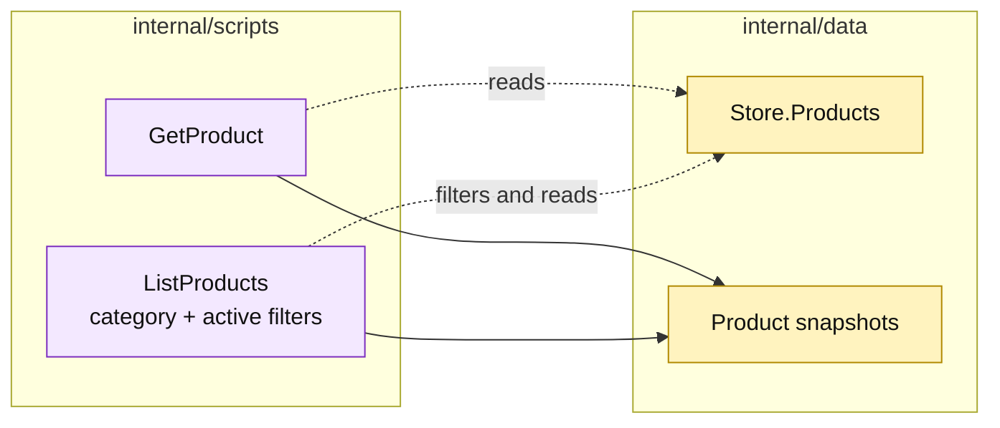

# Lesson 023: Add Product Query Scripts

## Objective

Expose catalog reads through `GetProduct` and `ListProducts` procedures.

## Theory

Products are used by quote scripts, stock scripts, pricing rules, and return eligibility. A small read surface lets callers inspect catalog data without reaching directly into `Store.Products`.

`ListProducts` supports optional category and active-only filters and sorts by SKU.

## Why This Matters Here

The same passive record is now a shared input to many procedures. A query script creates a named seam without pretending that the product is a rich aggregate. The tradeoff is another small procedure and continued coupling to the record shape.

## Diagram

Legend:

- purple: query procedures;
- yellow: passive catalog data and views;
- dashed arrows: reads and filters;
- solid arrows: result shaping.

## Implementation Focus

Implement only:

- `GetProduct`;
- `ListProducts` with category and active-only filters;
- deterministic SKU sorting;
- product query tests.

Leave customer queries for the next lesson.

## What To Verify

- `go test ./...` passes from `transaction-script-architecture/`;
- products can be read by SKU;
- category and active-only filters work;
- unavailable products can still be read when the filter is disabled.
