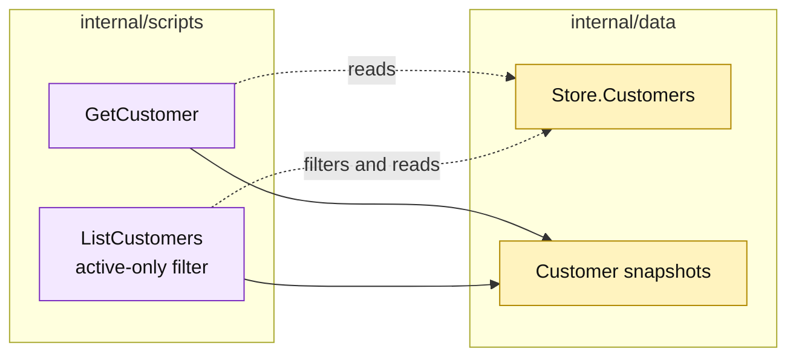

# Lesson 024: Add Customer Query Scripts

## Objective

Expose customer reads through `GetCustomer` and `ListCustomers`, including an active-only filter.

## Theory

Customer records participate in quote creation and later commercial decisions. Query scripts give callers a stable, read-only way to inspect them without exposing the store map.

`ListCustomers` sorts by customer ID and optionally omits inactive customers.

## Why This Matters Here

The query layer is now a family of small procedures rather than a generic repository abstraction. That keeps the Transaction Script comparison honest: each read is explicit, local, and easy to change, while repeated filtering and snapshot logic remain visible.

## Diagram

Legend:

- purple: query procedures;
- yellow: passive customer storage and views;
- dashed arrows: reads and filtering;
- solid arrows: result shaping.

## Implementation Focus

Implement only:

- `GetCustomer`;
- `ListCustomers` with an active-only option;
- deterministic customer-ID sorting;
- customer query tests.

Leave reporting projections for later lessons.

## What To Verify

- `go test ./...` passes from `transaction-script-architecture/`;
- a customer can be read by ID;
- active-only listing excludes inactive customers;
- unrestricted listing returns all customers in deterministic order.
