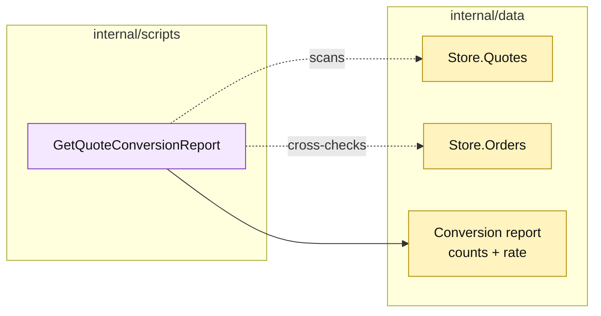

# Lesson 025: Build A Quote Conversion Report

## Objective

Add a read-only report procedure that calculates quote-to-order conversion metrics from the current store.

## Theory

Reports are queries over business records, not new lifecycle commands. `GetQuoteConversionReport` will count quotes, count converted quotes, and calculate a deterministic conversion rate.

The report does not maintain a projection or listen to events. It scans the passive store at read time.

## Why This Matters Here

This is the first reporting workload in the Transaction Script track. Direct scans are simple for a small in-memory application, but the script now knows the storage representation of conversion state and the metric's calculation rules. That coupling is an important tradeoff to observe.

## Diagram

Legend:

- purple: report procedure;
- yellow: passive source data and read model;
- dashed arrows: read-only scans;
- solid arrow: report shaping.

## Implementation Focus

Implement only:

- a `QuoteConversionReport` read model;
- `GetQuoteConversionReport`;
- tests for empty, partial, and complete conversion sets.

Leave category reports and low-stock reporting for later lessons.

## What To Verify

- `go test ./...` passes from `transaction-script-architecture/`;
- total and converted quote counts are correct;
- conversion rate is zero for an empty set;
- the report does not mutate quotes or orders.
