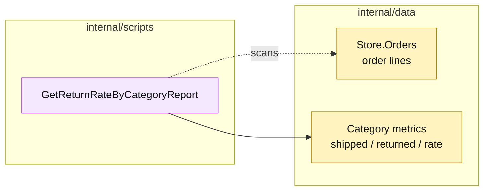

# Lesson 026: Report Return Rate By Category

## Objective

Add a read-only report that aggregates shipped and returned quantities by product category.

## Theory

Return requests contain workflow state, but return-rate reporting should measure the order facts: how many units shipped and how many were returned.

`GetReturnRateByCategoryReport` scans order lines, groups quantities by category, and calculates `returned / shipped` for each category. It returns sorted rows and never changes operational records.

## Why This Matters Here

The report is a small projection built at read time. That is a natural Transaction Script choice for a small data set, but the procedure now knows reporting semantics and every relevant write-model field. A larger system would likely move this work to a dedicated projection.

## Diagram

Legend:

- purple: report procedure;
- yellow: passive source data and read model;
- dashed arrow: read-only scan;
- solid arrow: aggregation result.

## Implementation Focus

Implement only:

- category report row and report types;
- `GetReturnRateByCategoryReport`;
- deterministic category sorting;
- tests for multiple categories and zero-return categories.

Leave low-stock and approval reports for later lessons.

## What To Verify

- `go test ./...` passes from `transaction-script-architecture/`;
- shipped and returned quantities aggregate correctly;
- categories with no returns report a zero rate;
- no order or return record is mutated.
