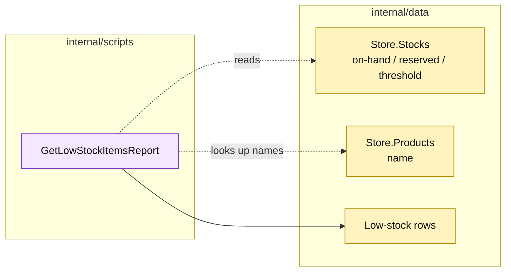

# Lesson 027: Build A Low-Stock Report

## Objective

Add a report that identifies products whose available quantity is at or below their reorder threshold.

## Theory

Inventory records keep `OnHand`, `Reserved`, and `ReorderThreshold`. The report calculates `Available = OnHand - Reserved` and returns rows at or below the threshold, optionally enriching them with product names from the catalog.

This is a read-time query over the write model; it does not reserve, receive, or alter stock.

## Why This Matters Here

The procedure is compact and useful for a small application. Its direct joins across `Stocks` and `Products` also show the cost of keeping all coordination in scripts: a catalog rename or a future inventory projection changes the report's assumptions directly.

## Diagram

Legend:

- purple: report procedure;
- yellow: passive source data and read model;
- dashed arrows: read-only scans/lookups;
- solid arrow: report shaping.

## Implementation Focus

Implement only:

- a low-stock report row;
- `GetLowStockItemsReport`;
- available-quantity calculation and deterministic SKU sorting;
- tests for threshold boundaries and missing product names.

Leave approval queue reporting for the next lesson.

## What To Verify

- `go test ./...` passes from `transaction-script-architecture/`;
- available quantity uses on-hand minus reserved;
- equal-to-threshold items are included;
- healthy stock is excluded;
- the report does not mutate inventory.
