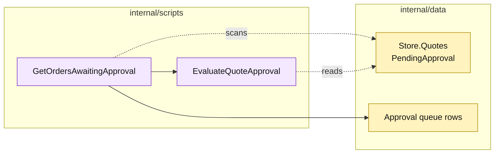

# Lesson 028: Report Quotes Awaiting Approval

## Objective

Add a read-only approval queue report for quotes in `PendingApproval` state.

## Theory

Managers need a queue view rather than a raw map scan. `GetOrdersAwaitingApproval` (the canonical report name) will select pending quotes, re-evaluate their procedural approval reasons, and return deterministic queue rows.

The report does not approve or mutate the quotes. It is a query over current passive records.

## Why This Matters Here

The report reuses the approval helper introduced earlier. That is one benefit of extracting plain procedures in Transaction Script. It also shows the coupling: the report must know which quote status is pending and how approval reasons are derived.

## Diagram

Legend:

- purple: report and reusable procedural rule;
- yellow: passive source records and read model;
- dashed arrows: read-only scans;
- solid arrows: report composition.

## Implementation Focus

Implement only:

- an approval queue row type;
- `GetOrdersAwaitingApproval`;
- pending-quote filtering and reason projection;
- deterministic quote-ID ordering;
- report tests.

Leave payment review for the next lesson.

## What To Verify

- `go test ./...` passes from `transaction-script-architecture/`;
- only pending quotes appear;
- custom-build reasons are visible;
- approved and rejected quotes are excluded;
- the report does not change quote state.
