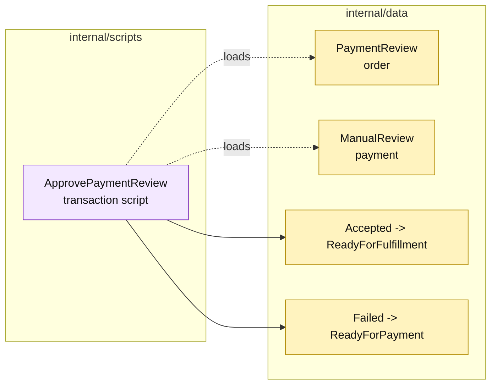

# Lesson 029: Resolve Payment Review

## Objective

Add a transaction script that resolves a manually reviewed payment into fulfillment or a retryable payment failure.

## Theory

`CapturePayment` can pause an order in `PaymentReview`, but a paused state is not a completed workflow. `ApprovePaymentReview` will:

1. load the order and its payment attempt;
2. require `PaymentReview` and `ManualReview`;
3. validate the reviewer and decision;
4. record reviewer metadata;
5. move the order to `ReadyForFulfillment` on acceptance or `ReadyForPayment` on rejection.

The payment and order are passive records; the transition sequence lives in the script.

## Why This Matters Here

The payment flow now has an explicit asynchronous-looking pause without introducing events or a state-machine object. That is straightforward for a small application, while the repeated status checks and metadata writes show where a richer workflow abstraction might eventually help.

## Diagram

Legend:

- purple: procedural payment workflow;
- yellow: passive payment/order state;
- dashed arrows: record reads and preconditions;
- solid arrows: resulting transition.

## Implementation Focus

Implement only:

- payment review metadata and decision values;
- `ApprovePaymentReview`;
- accepted and rejected review paths;
- reviewer, missing payment, invalid decision, and wrong-state tests.

Leave partial fulfillment for later lessons.

## What To Verify

- `go test ./...` passes from `transaction-script-architecture/`;
- manual review can be accepted;
- accepted review makes the order fulfillable;
- rejected review returns the order to payment retry;
- reviewer and decision comment are persisted.
