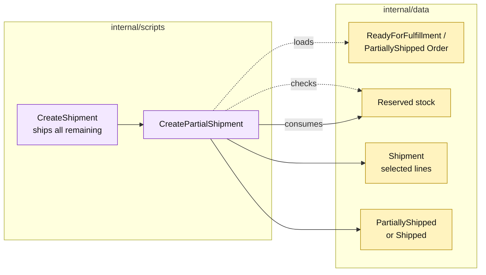

# Lesson 030: Support Partial Shipments

## Objective

Extend shipment processing so a paid order can ship selected quantities while retaining the remaining fulfillment state.

## Theory

The original `CreateShipment` script assumed every reserved line shipped together. Real fulfillment may split an order across warehouse availability or delivery batches.

`CreatePartialShipment` will:

1. load a fulfillable order;
2. validate the requested order-line quantities against remaining reserved stock;
3. create a shipment for only those quantities;
4. consume the matching stock;
5. set the order to `PartiallyShipped` or `Shipped` depending on what remains.

The existing full-shipment procedure becomes a convenience call that asks the same workflow to ship all remaining lines.

## Why This Matters Here

The change is small in code but meaningful architecturally: a previously simple transaction now needs line-level matching and aggregate status derivation. Transaction Script keeps that complexity in one procedure and makes the growing orchestration visible.

## Diagram

Legend:

- purple: procedural fulfillment workflow;
- yellow: passive order, stock, and shipment records;
- dashed arrows: reads and validation;
- solid arrows: shipment and state writes.

## Implementation Focus

Implement only:

- `CreatePartialShipment`;
- line-level quantity validation;
- partial versus complete order status;
- full-shipment delegation through the same procedure;
- tests for partial, complete, and invalid shipments.

Leave partial returns for the next lesson.

## What To Verify

- `go test ./...` passes from `transaction-script-architecture/`;
- a subset of reserved lines can be shipped;
- the order becomes `PartiallyShipped` when work remains;
- a later shipment can finish the order;
- stock is consumed only for the selected quantities.
