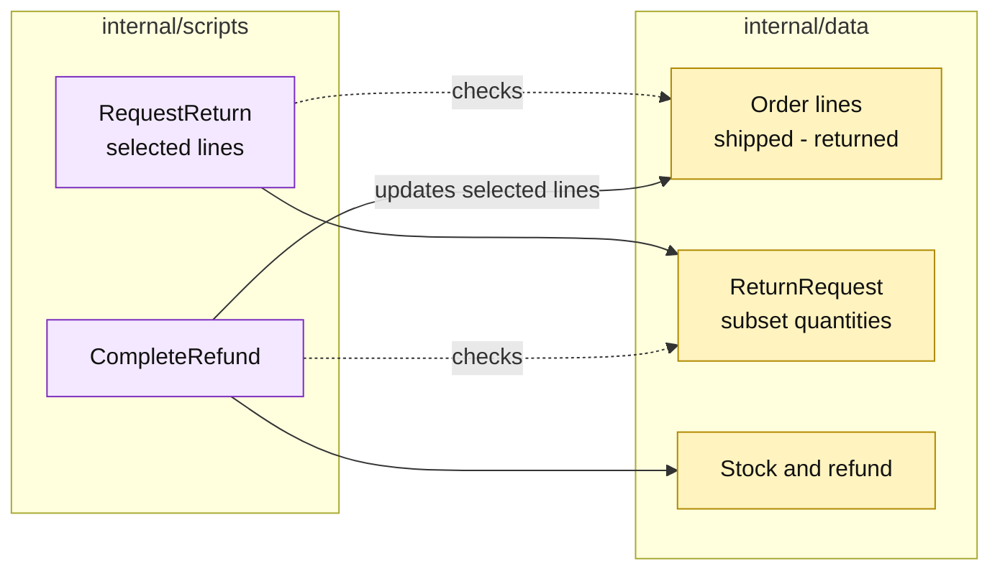

# Lesson 031: Support Partial Returns By Line

## Objective

Make partial return behavior explicit: a request can return selected quantities from selected order lines without consuming the remaining returnable quantities.

## Theory

The return scripts already validate quantities against shipped order lines. This lesson tightens that boundary:

- explicit line selections are preserved;
- one order line cannot appear twice in the same request;
- acceptance updates only the selected line quantities;
- a later request can return the remaining quantity.

The order and return records remain passive. The scripts perform line matching and quantity arithmetic directly.

## Why This Matters Here

Partial fulfillment and partial returns are where line-level bookkeeping becomes essential. Transaction Script keeps the rule close to the workflow, which is clear for a small process but increases the amount of repeated matching code that future commands must understand.

## Diagram

Legend:

- purple: return procedures;
- yellow: passive line-level records and side effects;
- dashed arrows: quantity checks;
- solid arrows: selected-line writes.

## Implementation Focus

Implement only:

- duplicate line detection in `RequestReturn`;
- explicit partial-return tests;
- selective order returned-quantity and restock updates;
- a second return over the remaining quantity.

Leave pricing plugins for the next lesson.

## What To Verify

- `go test ./...` passes from `transaction-script-architecture/`;
- one line can be returned without changing another;
- a later request can return the remaining quantity;
- duplicate line entries are rejected before any return is saved.
