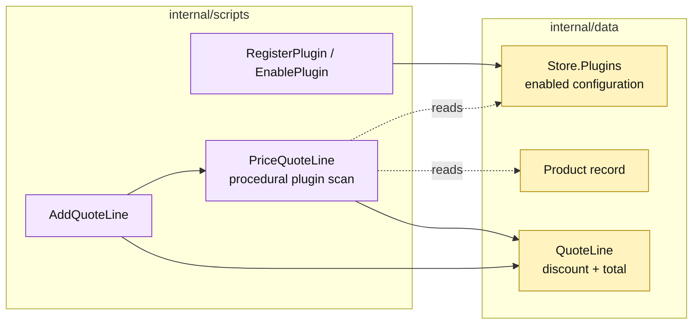

# Lesson 032: Add A Plugin Pricing Extension Point

## Objective

Add a small plugin registry and let enabled pricing plugins contribute deterministic quote-line discounts.

## Theory

The application now has a repeated need for replaceable business variation. A pricing plugin is a useful final extension lesson:

1. register a plugin and its configuration;
2. enable it through a transaction script;
3. when a quote line is added, scan enabled pricing plugins;
4. apply their configured discount contributions deterministically;
5. persist the resulting discount and line total on the passive quote line.

The extension point is intentionally procedural. Plugin configuration is data, and the pricing script interprets it. There is no plugin interface, reflection, or dependency-injection container.

## Why This Matters Here

Transaction Script can support extension points, but the extension logic remains coupled to the storage record and configuration keys. That is simple to wire and easy to inspect; it becomes less attractive as plugin types, precedence rules, and safety constraints multiply.

## Diagram

Legend:

- purple: procedural extension and workflow;
- yellow: passive plugin/configuration and quote data;
- dashed arrows: data reads;
- solid arrows: registration or pricing writes.

## Implementation Focus

Implement only:

- passive plugin registration data;
- `RegisterPlugin`, `EnablePlugin`, and `DisablePlugin` scripts;
- configured pricing-plugin discount calculation;
- `AddQuoteLine` integration and pricing tests;
- deterministic behavior for multiple enabled pricing plugins.

Do not introduce a generic plugin framework or cross-architecture ports.

## What To Verify

- `go test ./...` passes from `transaction-script-architecture/`;
- an enabled pricing plugin changes line totals;
- disabled plugins have no effect;
- plugin configuration is persisted;
- multiple plugins produce deterministic capped discounts.
