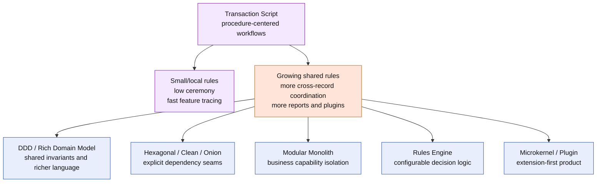

# Lesson 033: Why Not Stop At Transaction Script?

## Objective

Explain what the completed Transaction Script track handles well, which pressures are now visible, and when another architecture may be a better next step.

## Short Answer

You absolutely could stop here for a small or medium system whose workflows are mostly local and whose rules are easy to follow procedurally.

This track now includes:

- quote creation, editing, approval, rejection, and conversion;
- reservation, payment, review, shipment, cancellation, and returns;
- partial shipment and partial return quantities;
- idempotent return commands;
- query procedures and read-time reports;
- a configured pricing-plugin extension point.

Transaction Script made each use case concrete: a procedure loads records, validates facts, applies rules, writes records, and returns a result.

The question is not whether the architecture can implement more behavior. It can. The question is whether the next kind of complexity is still easiest to reason about in procedures that know the storage shape directly.

## What Transaction Script Is Good At

### 1. Local Workflow Clarity

`CreateDraftQuote`, `ConvertQuoteToOrder`, `CompleteRefund`, and `CreatePartialShipment` read like the business operation they implement. A developer can trace the happy path without navigating a large object graph or dependency-injection setup.

### 2. Low Ceremony

Passive records, a shared in-memory store, and plain functions are enough to demonstrate a broad business surface. This is useful when the main risk is delivery speed or when the business rules are still simple.

### 3. Testable Procedures

Each transaction script accepts a store and returns a result or business error. The tests can set up only the records needed for one workflow and observe the exact state changes.

### 4. Honest Cross-Record Coordination

Reservation, payment, shipment, refund, and restocking are visibly coordinated where they happen. The architecture does not hide consistency work behind a generic repository or imply that persistence solves business sequencing automatically.

### 5. A Practical Baseline

The track is a useful baseline for comparing richer alternatives. It shows the minimum structure needed to express the canonical workflows before adding aggregates, ports, modules, or rule engines.

## The Pressure We Can See Now

### 1. Scripts Know Too Much About Storage

The conversion script knows quote fields, order fields, product shortage policies, stock arithmetic, and map-backed persistence. The return scripts know order-line quantities, eligibility snapshots, refund records, and inventory updates.

That directness is the benefit at first. As shared rules multiply, it becomes a coupling surface.

### 2. Related Rules Can Drift

Approval evaluation, return eligibility, payment review, shipment eligibility, and cancellation each have procedural checks. Some helpers were extracted, but every new command still needs to remember which helper and which status rules apply.

The architecture does not prevent two scripts from eventually implementing subtly different versions of the same rule.

### 3. Lifecycle Invariants Are Distributed

Quote, order, payment, shipment, return, and refund transitions are constants and conditionals spread across procedures. The code can enforce them, but the records themselves cannot protect their invariants when another script writes them directly.

### 4. Multi-Record Transactions Need Careful Preflight

The scripts explicitly preflight reservation, shipment, return, refund, and restock changes. That is workable in memory. A real database would also need transaction boundaries, concurrency control, and recovery behavior.

### 5. Queries And Reports Scan The Write Model

The query and report procedures are simple and deterministic, but they read the same passive shapes used by commands. If reporting volume, history, or dashboard requirements grow, dedicated projections may be easier to operate.

### 6. Extension Logic Is Still Configuration-Aware Procedure Code

The pricing plugin works, but plugin configuration is a map and plugin behavior is interpreted by the pricing procedure. More plugin types, precedence rules, validation, or third-party ownership would push toward a stronger extension architecture.

## What This Does Not Mean

This track did not fail because it accumulated more code. A Transaction Script system can grow further, and many real applications remain intentionally procedural.

The tradeoff is about where complexity lives:

- Transaction Script keeps complexity close to each workflow;
- richer domain models move shared invariants into domain objects;
- hexagonal or clean styles add explicit dependency boundaries;
- modular monoliths organize complexity around business capabilities;
- rules engines externalize configurable decision logic;
- microkernel designs make extension capability the center of the architecture.

None of those alternatives is automatically better. Each optimizes for a different pressure.

## Diagram

Legend:

- purple: strengths and center of gravity of Transaction Script;
- orange: pressure revealed by the completed sample;
- blue: possible next architecture, selected according to the dominant problem.

## Practical Handoff Questions

Continue comparing architectures when the answer to one of these becomes yes:

- Do several workflows need the same invariant protected from every caller?
- Are procedures repeating state transitions or data-mutation rules?
- Do teams need stronger boundaries between quoting, ordering, fulfillment, returns, and plugins?
- Do reports need independent read models or historical projections?
- Do rules need to be configured or authored outside ordinary code changes?
- Are plugins becoming a primary product capability rather than one extension point?
- Is the cost of direct storage coupling now greater than the cost of explicit boundaries?

If the answer is no, Transaction Script may still be the most honest and economical choice.

## Implementation Focus

This closing lesson adds no new business behavior. It records the architectural comparison at the completed state and points to the next experiment based on observed pressure rather than fashion.

## What To Verify

- all lessons `000` through `033` exist in this architecture;
- the final code remains a collection of procedural scripts over passive records;
- `go test ./...` passes from `transaction-script-architecture/`;
- the next architecture is chosen because of a concrete complexity pressure, not because Transaction Script is universally wrong.
